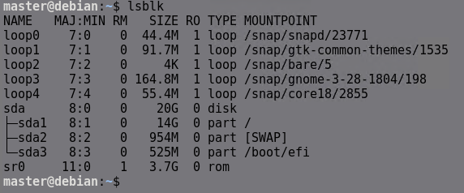

# **Linux Disk ve Dosya Sistemi Yönetimi**

## **Diskleri Listeleme**
**1. `df -h`**

*   **Açıklama:** `df` (disk free) komutu, sisteme bağlı (mount edilmiş) dosya sistemlerinin disk kullanım istatistiklerini raporlar. `-h` (human-readable) seçeneği, boyutları bayt yerine Kilobayt (K), Megabayt (M), Gigabayt (G) gibi insanlar tarafından daha kolay okunabilir birimlerde gösterir. Bu komut, hangi dosya sisteminin ne kadar dolu olduğunu hızla görmek için kullanılır.
*   **Kullanım Şekli:**
    ```bash
    df -h
    ```
    Ayrıca belirli bir dosya veya dizinin bulunduğu dosya sisteminin durumunu görmek için:
    ```bash
    df -h /path/to/directory_or_file
    ```
*   **Örnek Çıktı:**

    

    
   
*   **Sütunların Açıklamaları:**
    *   `Size`: Toplam boyutu. `-h` sayesinde okunabilir birimlerde (G, M, T).
    *   `Used`: Dosya sistemi üzerinde kullanılan alan miktarı.
    *   `Avail` (Available): Dosya sistemi üzerinde *normal kullanıcılar* için kullanılabilir (boş) alan miktarı. Genellikle toplam boyut ile kullanılan boyut arasındaki farktan biraz daha azdır, çünkü Linux dosya sistemleri (özellikle ext4) genellikle kök (root) kullanıcı için küçük bir yüzde (%5 gibi) ayırır. Bu, disk tamamen dolduğunda bile root kullanıcısının sisteme giriş yapıp sorunu çözebilmesi içindir.
    *   `Use%`: Kullanılan alanın toplam alana göre yüzdesi (`Used / Size * 100`).
    *   `Mounted on`: Dosya sisteminin, sistemin dizin ağacında nereye bağlandığını gösteren bağlama noktası (mount point).

**2. `lsblk -p`**

*   **Açıklama:** `lsblk` (list block devices) komutu, sistemdeki tüm blok aygıtlarını (diskler, disk bölümleri, CD/DVD sürücüleri, LVM birimleri, RAID aygıtları vb.) ve aralarındaki ilişkileri (hangi bölüm hangi diske ait gibi) ağaç yapısında listeler. `-p` seçeneği, aygıt adlarının tam yolunu (`/dev/sda` gibi) göstermesini sağlar (varsayılan olarak sadece `sda` gibi kısa adları gösterir). Diskleri, bölümlerini ve varsa LVM veya RAID yapılarını görmek için çok kullanışlıdır.
*   **Kullanım Şekli:**
    ```bash
    lsblk -p
    ```
    Belirli bir aygıtı ve altındakileri görmek için:
    ```bash
    lsblk -p /dev/sda
    ```
*   **Örnek Çıktı:**

     

     
     
*   **Sütunların Açıklamaları:**
    *   `NAME`: Aygıtın tam yolu (`-p` sayesinde). Ağaç yapısı, aygıtlar arasındaki ilişkiyi gösterir 
    *   `MAJ:MIN`: Aygıtın çekirdek tarafından kullanılan major ve minor numaraları. Genellikle son kullanıcı için doğrudan önemli değildir.
        
        Maj
        - 8 → SCSI/SATA diskleri (/dev/sd*)
        - 7 → Loop aygıtları (/dev/loop*)
        - 1 → RAM disk (/dev/ram*)
        - 11 → CD-ROM (/dev/sr*)

        Min

        - 8:0 → /dev/sda (birinci disk)
        - 8:1 → /dev/sda1 (ilk bölüm)
        - 7:0 → /dev/loop0 (birinci loop aygıtı)


    *   `RM` (Removable): Aygıtın çıkarılabilir olup olmadığını gösterir (`1` evet, `0` hayır). USB bellekler veya CD/DVD sürücüleri için `1` olur.
    *   `SIZE`: Aygıtın veya bölümün toplam boyutu. Genellikle otomatik olarak okunabilir formatta gösterilir.
    *   `RO` (Read-Only): Aygıtın salt okunur olup olmadığını gösterir (`1` evet, `0` hayır).
    *   `TYPE`: Aygıtın türü (`disk`: fiziksel disk, `part`: disk bölümü, `lvm`: LVM mantıksal birimi, `raid0`/`raid1`/`raid5` vb.: RAID aygıtı, `rom`: CD/DVD sürücü, `crypt`: şifreli aygıt).
    *   `MOUNTPOINT`: Eğer aygıt bir dosya sistemi içeriyorsa ve sisteme bağlıysa, bağlandığı dizini (bağlama noktası) gösterir. Bağlı değilse veya bir dosya sistemi içermiyorsa (örn. LVM için PV olarak kullanılan bir bölüm) bu sütun boştur.

**3. `sudo parted -l`**

*   **Açıklama:** `parted` güçlü bir disk bölümleme aracıdır. `-l` (list) seçeneği ile kullanıldığında, `parted` sistemdeki tüm blok aygıtlarını tarar ve her biri için detaylı bölümleme tablosu bilgilerini listeler. 

*   **Kullanım Şekli:**
    ```bash
    sudo parted -l
    ```

*   **Örnek Çıktı (Kısaltılmış):**

    
     
*   **Çıktı Bölümlerinin ve Sütunlarının Açıklamaları:**
    *   `Model`: Diskin marka ve model bilgisi.
    *   `Disk /dev/sdX`: Diskin aygıt yolu ve toplam boyutu.
    *   `Sector size (logical/physical)`: Diskin mantıksal ve fiziksel sektör boyutları. Gelişmiş formatlama ve hizalama için önemli olabilir.
    *   `Partition Table`: Bölümleme tablosunun türü (`gpt` veya `msdos` (MBR için)).
    *   `Disk Flags`: Diskin geneliyle ilgili özel bayraklar (GPT için genellikle boş).
    *   **Bölüm Listesi Tablosu:**
        *   `Number`: Bölüm numarası (1, 2, 3...).
        *   `Start`: Bölümün disk üzerindeki başlangıç konumu.
        *   `End`: Bölümün disk üzerindeki bitiş konumu.
        *   `Size`: Bölümün toplam boyutu.
        *   `File system`: `parted`'ın bölüm içinde algıladığı dosya sistemi türü (örn: `ext4`, `xfs`, `ntfs`, `fat32`, `linux-swap`). Bazen bölüm formatlanmamışsa veya tanınmayan bir türdeyse boş olabilir veya sadece `linux` gibi genel bir ifade olabilir.
        *   `Name`: Bölüme verilen isim (Bu özellikle GPT bölümleme tablosunda anlamlıdır).
        *   `Flags`: Bölüme atanmış özel bayraklar. Örneğin:
            *   `boot`: (GPT ve MBR'da) Bu bölümün önyüklenebilir olduğunu işaretler.
            *   `esp`: (GPT'de) EFI Sistem Bölümü olduğunu işaretler (genellikle `boot` ile birlikte kullanılır).
            *   `lvm`: Bu bölümün LVM tarafından kullanıldığını işaretler.
            *   `raid`: Bu bölümün Yazılımsal RAID için kullanıldığını işaretler.
            *   `swap`: Bu bölümün takas alanı olarak işaretlendiğini gösterir.

**4. `sudo blkid`**

*   **Açıklama:** `blkid`  komutu, Linux'ta bağlı olan blok aygıtlarının (disk, bölüm, USB, vs.) tanımlayıcı bilgilerini görüntülemek için kullanılır. Özellikle dosya sistemlerine ait UUID, LABEL, TYPE gibi bilgileri gösterir.

*   **Kullanım Şekli:**
    ```bash
    sudo blkid
    ```
    Belirli bir aygıtın bilgilerini almak için:
    ```bash
    sudo blkid /dev/sda1
    ```

*   **Örnek Çıktı:**

    

*   **Çıktıdaki Alanların Açıklamaları:**
    *   `/dev/sda1:` : Bilgileri listelenen blok aygıtının yolu.
    *   `LABEL="..."`: Dosya sistemine formatlanırken veya sonradan atanmış olan (isteğe bağlı) etiket. İnsanlar için okunabilir bir isim sağlar.
    *   `UUID="..."`: Dosya sistemi oluşturulduğunda atanan evrensel olarak benzersiz tanımlayıcı. Aygıt adları değişse bile aynı kalan, kararlı bir tanımlayıcıdır (`/etc/fstab` için ideal).
    *   `TYPE="..."`: Algılanan dosya sistemi veya kullanım türü (örn: `ext4`, `xfs`, `vfat`, `ntfs`, `swap`, `LVM2_member`).
    *   `PARTUUID="..."`: (Sadece GPT bölümleri için) Bölümleme tablosunda doğrudan bölüme atanmış benzersiz tanımlayıcı. Dosya sisteminin UUID'sinden farklıdır ve bölüm yeniden formatlansa bile aynı kalır (bölüm silinip yeniden yaratılmadıkça).

## **Yeni Disk Ekleme ve Bölümlendirme**

Öncelikle makineye yeni bir disk ekliyoruz ve lsblk komutuyla makinenin diski tanıyıp tanımadığını kontrol ediyoruz.


**`fdisk` Komutu**

1.  **Bölümleri Listeleme:**
    *   Belirli bir diskin bölüm tablosunu listelemek için:
        ```bash
        sudo fdisk -l /dev/sdX
        ```
        (Burada `/dev/sdX`, incelemek istediğiniz diskin adıdır, örn: `/dev/sda`, `/dev/sdb`). `sudo` gereklidir çünkü disk bilgilerine erişim yönetici yetkisi ister.
    *   Sistemdeki tüm disklerin bölüm tablolarını listelemek için (bazen disk adı belirtilmeden de çalışır):
        ```bash
        sudo fdisk -l
        ```
    *   **`-l` Seçeneği Çıktısı:** Bu komut size disk modeli, boyutu, sektör boyutu, bölümleme tablosu türü (MBR için `dos` yazar, GPT için `gpt`) ve her bir bölümün Aygıt adı (Device), Başlangıç (Start) ve Bitiş (End) sektörleri, Sektör Sayısı (Sectors), Boyutu (Size), Tür ID'si (Id) ve Tür Adı (Type) gibi bilgileri gösterir.

        

---

2.  **Etkileşimli Bölümleme Modu:**
    *   Bir disk üzerinde değişiklik yapmak için `fdisk`'i etkileşimli modda başlatmanız gerekir:
        ```bash
        sudo fdisk /dev/sdX
        ```
      
    *   Bu komutu çalıştırdığınızda, `fdisk` bir komut istemi (`Command (m for help):`) ile açılır. Burada çeşitli tek harfli komutlar kullanarak işlem yaparsınız.

*   **Etkileşimli Moddaki Temel Komutlar:**

    *   `m`: Yardım menüsünü gösterir, mevcut tüm komutları listeler.
    *   `p`: Mevcut bölüm tablosunu ekrana yazdırır (henüz diske kaydedilmemiş değişiklikleri de gösterir). Değişiklik yapmadan önce ve sonra durumu kontrol etmek için kullanılır.
    *   `n`: Yeni bir bölüm eklemek için kullanılır. Size bölüm türünü (primary/extended/logical - MBR için), bölüm numarasını, ilk ve son sektörü (veya boyutu) sorar.
    *   `d`: Mevcut bir bölümü silmek için kullanılır. Sizden silmek istediğiniz bölümün numarasını ister.
    *   `F`: Diskte kullanılmayan alanı gösterir.
    *   `w`: **ÇOK ÖNEMLİ:** Yaptığınız **tüm değişiklikleri diske yazar** ve `fdisk`'ten çıkar. Bu işlem geri alınamaz! Emin olmadan bu komutu kullanmayın.
    *   `q`: **ÇOK ÖNEMLİ:** Yaptığınız **hiçbir değişikliği diske yazmadan** `fdisk`'ten çıkar. Eğer emin değilseniz veya hata yaptıysanız bu komutla güvenle çıkabilirsiniz.
    *   `l`: Bilinen bölüm türlerinin (sistem ID'leri ve adları) listesini gösterir (`t` komutu ile kullanılır).

        

*   **Örnek Disk Bölümlerndirme**

    1.  `sudo fdisk /dev/sdb` 
    2.  `n` (Yeni bölüm ekle)
    3.  `p` (Birincil bölüm (primary) için, varsayılan) -> Enter
    4.  `1` (Bölüm numarası 1 için, varsayılan) -> Enter
    5.  (İlk sektör sorulur, varsayılanı kabul et) -> Enter
    6.  (Son sektör sorulur, tüm diski kaplamak için varsayılanı kabul et veya `+5G` gibi boyut belirt) -> Enter
    7.  `w` (Değişiklikleri diske yaz ve çık - **EMİN OLDUKTAN SONRA!**)

    

    

    


## **Disk Formatlama ve Mount Etme**


**1. `mkfs` (Make Filesystem)**


*   `mkfs` komutu, bir disk bölümünü (partition) veya başka bir blok aygıtını (örneğin bir LVM mantıksal birimi) belirli bir **dosya sistemi türü** ile **formatlamak** için kullanılır.
*   Kısacası, ham bir disk bölümünü, Linux'un üzerine veri yazıp okuyabileceği bir yapıya dönüştürür.
*   `mkfs` aslında genellikle bir ön uç (frontend) programıdır. Gerçek formatlama işini, belirtilen dosya sistemi türüne özel olan `mkfs.TÜR` (örneğin `mkfs.ext4`, `mkfs.xfs`, `mkfs.vfat`) komutları yapar. `mkfs` komutunu `-t` seçeneği ile kullanırsanız, o da arka planda uygun `mkfs.TÜR` komutunu çağırır.


**2. `mount`**

    ```bash
    sudo mount <aygıt> <bağlama_noktası>
    ```
*   `<aygıt>`: Bağlanacak dosya sistemini içeren aygıt (örn: `/dev/sdb1`).
*   `<bağlama_noktası>`: Aygıtın bağlanacağı, sistemde var olan boş bir dizin **Bu dizin önceden oluşturulmuş olmalıdır!** (`sudo mkdir` gibi).


mount işlemi varsayılan olarak geçicidir yani sistem reboot olduğu zaman mount kaybolacaktır kalıcı mount oluşturmak için `/etc/fstab`dosyasına eklenmelidir.


**`/etc/fstab` Dosyasının Yapısı**

Bu dosya, her satırı tek bir dosya sistemi bağlamasını temsil eden bir dizi kayıttan oluşur. Her satır, boşluk (space) veya sekme (tab) karakterleriyle ayrılmış **altı** alandan (sütundan) oluşur. İşte bu alanların açıklamaları:

```
# <file system> <mount point>   <type>  <options>       <dump>  <pass>
```

1.  **`<file system>` (Dosya Sistemi Kaynağı):**
    *   **Ne Tanımlar:** Bağlanacak olan dosya sisteminin kaynağını belirtir.
    *   **Değerler:**
        *   **Aygıt Yolu:** `/dev/sda1`, `/dev/nvme0n1p2`, `/dev/mapper/vg_data-lv_app` gibi blok aygıtının doğrudan yolu. **Ancak bu yöntem önerilmez!** Çünkü disklerin veya bölümlerin sırası (a, b, c...) sistem yeniden başladığında veya yeni disk eklendiğinde değişebilir ve yanlış bölümün bağlanmasına neden olabilir.
        *   **UUID (Universally Unique Identifier) - ŞİDDETLE TAVSİYE EDİLİR:** `UUID=xxxxxxxx-xxxx-xxxx-xxxx-xxxxxxxxxxxx` formatında, dosya sistemi oluşturulduğunda atanan benzersiz bir tanımlayıcıdır. Aygıt sırası değişse bile bu değer değişmez, bu yüzden en güvenilir yöntemdir. `sudo blkid /dev/sdXN` komutu ile öğrenilebilir.
    
2.  **`<mount point>` (Bağlama Noktası):**
    *   **Ne Tanımlar:** Yukarıdaki `<file system>` kaynağının, Linux dizin ağacında hangi dizine bağlanacağını belirtir.
    *   **Değerler:** `/`, `/home`, `/boot`, `/var`, `/mnt/data`, `/media/usbdisk` gibi sistemde var olan geçerli bir dizin yolu olmalıdır. `/` (kök dizin) ve `swap` hariç, bu dizinin bağlama yapılmadan önce **mevcut olması gerekir**. `swap` için bu alan `none` olarak ayarlanır.

3.  **`<type>` (Dosya Sistemi Türü):**
    *   **Ne Tanımlar:** Bağlanacak dosya sisteminin türünü belirtir.
    *   **Değerler:** `ext4`, `xfs`, `btrfs`, `vfat` (FAT32), `ntfs` (veya `ntfs-3g`), `iso9660` (CD/DVD), `nfs`, `cifs`, `swap` (takas alanı için), `auto` (sistemin otomatik algılamasını sağlar, ancak belirli olmak genellikle daha iyidir).

4.  **`<options>` (Bağlama Seçenekleri):**
    *   **Ne Tanımlar:** Dosya sisteminin nasıl bağlanacağını kontrol eden, virgülle ayrılmış bir veya daha fazla seçeneği belirtir.
    *   **Yaygın Değerler:**
        *   `defaults`: Genellikle çoğu dosya sistemi için uygun standart seçenekler kümesini ifade eder. Tipik olarak şunları içerir: `rw` (okuma-yazma), `suid` (setuid/setgid bitlerine izin ver), `dev` (karakter/blok aygıtlarına izin ver), `exec` (çalıştırılabilir dosyalara izin ver), `auto` (sistem başlangıcında `-a` ile otomatik bağla), `nouser` (sadece root bağlayabilir/ayırabilir), `async` (G/Ç işlemleri eşzamansız yapılsın).
        *   `auto`: Sistem başlangıcında veya `mount -a` komutuyla otomatik olarak bağlanır ( `defaults` içinde bulunur).
        *   `noauto`: Otomatik olarak bağlanmaz, sadece manuel olarak `mount <mount_point>` komutuyla bağlanabilir. (Örn: USB diskler için kullanılabilir).
        *   `rw`: Okuma-yazma modunda bağla.
        *   `ro`: Salt okunur modda bağla.

5.  **`<dump>` (Yedekleme Frekansı):**
    *   **Ne Tanımlar:** Eski `dump` yedekleme aracı tarafından kullanılır. Dosya sisteminin ne sıklıkla yedekleneceğini belirtir.
    *   **Değerler:**
        *   `0`: Yedekleme yapılmaz (günümüzde neredeyse her zaman `0` kullanılır).
        *   `1` veya daha yüksek: Yedekleme önceliğini belirtir (artık pek kullanılmıyor).

6.  **`<pass>` (Fsck Sırası):**
    *   **Ne Tanımlar:** Sistem başlangıcında `fsck` (filesystem check) aracının dosya sistemlerini hangi sırada kontrol edeceğini belirtir.
    *   **Değerler:**
        *   `0`: Kontrol edilmez.
        *   `1`: İlk kontrol edilecek dosya sistemi (genellikle sadece kök `/` dosya sistemi için kullanılır).
        *   `2`: Kök dosya sistemi kontrol edildikten sonra kontrol edilecek diğer dosya sistemleri.
    *   Aynı `<pass>` değerine sahip dosya sistemleri paralel olarak kontrol edilebilir (eğer `fsck` ve sistem destekliyorsa).

**`/etc/fstab` Dosyasına Nasıl Mount Eklenir (Adım Adım)**

**Ön Koşullar:**
*   Bağlamak istediğiniz bölüm formatlanmış olmalıdır (`mkfs` komutu ile).
*   Bağlama noktası olarak kullanacağınız dizin sistemde var olmalıdır (`mkdir` komutu ile oluşturabilirsiniz).

**Adımlar:**

1.  **Gerekli Bilgileri Toplayın:**
    *   **UUID:** Bağlamak istediğiniz bölümün UUID'sini öğrenin (örn: `/dev/sdb1` için):
        ```bash
        sudo blkid /dev/sdb1
        ```
        Çıktıdaki `UUID="xxxxxxxx-..."` kısmını kopyalayın.
    *   **Dosya Sistemi Türü:** Bölümün dosya sistemi türünü bilin 

2.  **`/etc/fstab` Dosyasını Düzenleyin:**
    Bir metin düzenleyiciyi `sudo` ile açın (örn: `nano`, `vim`):
    ```bash
    sudo nano /etc/fstab
    ```

3.  **Yeni Satırı Ekleyin:**
    Dosyanın sonuna, topladığınız bilgileri kullanarak yeni bir satır ekleyin. Alanları boşluk veya sekme ile ayırdığınızdan emin olun. Örneğin:
    ```
    # Yeni Data Diski için eklenen satır
    UUID=BURAYA_KOPYALADIGINIZ_UUID /home/user/yedek      ext4    defaults  0       2
    ```

Yukarıdaki adımlar aşağıda gösterilmiştir.


## **Grafiksel Disk Yönetimi**

Grafiksel disk yönetimi için birçok farklı uygulama vardır, bunlardan biri olan gparted aşağıda gösterilmiştir.

```
apt install gparted
```


uygulama aracılığıyla disk üzerinde işlemler yapılabilir.

